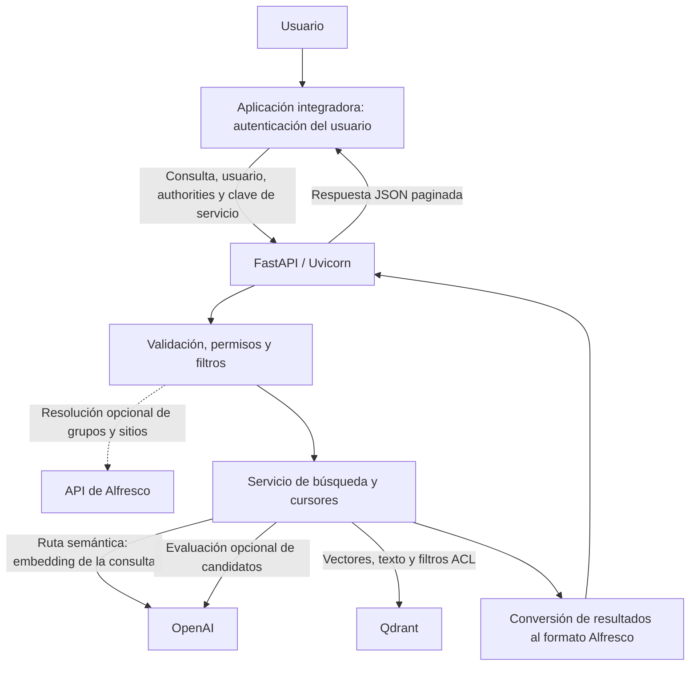

# alfdockia-community-search-ia

**Versión 1.0.0 · AIgen Technologies S.L**  
Paquete Python: `alfdockia.community.search.ia`.

Servicio de búsqueda para documentos de Alfresco previamente indexados en Qdrant.
Expone una API HTTP con respuestas compatibles con la estructura de búsqueda de
Alfresco y combina búsqueda semántica, búsqueda textual y evaluación de relevancia.
Aplica los permisos de los documentos y permite filtrar por tipos, aspectos y propiedades.

Esta guía explica la arquitectura, la configuración y cómo desplegar el servicio.
El módulo no indexa documentos ni instala Alfresco o Qdrant; estos componentes y
la sincronización de contenidos y permisos deben estar disponibles por separado.

## Índice

- [Arquitectura](#arquitectura)
- [Requisitos](#requisitos)
- [Despliegue con Docker Compose](#despliegue-con-docker-compose)
- [Ejecución con Python](#ejecución-con-python)
- [Referencia de configuración](#referencia-de-configuración)
- [Uso de la API](#uso-de-la-api)
- [Operación y resolución de problemas](#operación-y-resolución-de-problemas)
- [Desarrollo y documentación técnica](#desarrollo-y-documentación-técnica)

## Arquitectura



### Componentes y responsabilidades

El código se encuentra en `alfdockia/community/search/ia/`:

| Componente | Archivos | Responsabilidad |
| --- | --- | --- |
| API HTTP | `main.py` | Endpoints, validación inicial, errores y caché de respuestas. |
| Configuración | `config.py` | Lectura de variables de entorno mediante `Settings`. |
| Contrato de entrada | `request_parser.py`, `filter_contract.py` | Consulta, paginación y validación de filtros de metadatos. |
| Seguridad | `security.py` | Clave de servicio, principal y resolución opcional de authorities en Alfresco. |
| Filtros | `qdrant_filter.py` | Condiciones ACL, documentos activos, tipos, aspectos y propiedades. |
| Búsqueda | `search_service.py` | Selección de ruta, recuperación, relevancia y páginas. |
| Cursores | `cursor.py` | Firma HMAC, caducidad y vinculación del cursor a la búsqueda. |
| OpenAI | `openai_client.py`, `relevance.py` | Embeddings y evaluación de candidatos con un modelo de lenguaje. |
| Qdrant y HTTP | `qdrant_client.py`, `http_json.py` | Consultas vectoriales, Count/Scroll y transporte JSON. |
| Resultados | `models.py`, `response_mapper.py` | Modelos internos y respuesta con `list.entries` y `list.pagination`. |
| Versión | `__init__.py` | Fuente de la versión del paquete y de la API. |

No hay base de datos local ni proceso de indexación en este módulo. La caché de
respuestas reside en memoria de cada proceso y está desactivada por defecto.

### Cómo se ejecuta una búsqueda

1. La aplicación integradora envía la consulta y un principal de confianza
   (usuario y authorities: identificadores de usuarios, grupos o roles).
2. El servicio comprueba la clave de acceso, interpreta la petición y, si está
   habilitado, consulta grupos y sitios del usuario en Alfresco.
3. Construye los filtros de Qdrant: `alive=true`, `isFile=true`, permisos y metadatos.
4. Elige la ruta de recuperación indicada a continuación.
5. Devuelve resultados paginados y, cuando hay más resultados, un cursor firmado.

| Ruta | Recuperación | Uso de OpenAI | Total de resultados |
| --- | --- | --- | --- |
| `interactive`, ruta semántica | Vector denso + BM25 en Qdrant, fusionados con RRF; evaluación de relevancia por defecto. | Embedding de la consulta y evaluación LLM si está activa. | `totalItems=null`, `totalItemsExact=false`. |
| `interactive`, consulta general reconocida con coincidencia textual | Count/Scroll con filtro sobre `searchText`. Si no hay coincidencias, pasa a la ruta semántica. | Sin llamadas en esta ruta textual. | Total exacto. |
| `bulk` | Scroll de coincidencias textuales, con ACL y metadatos. | Sin llamadas. | Se calcula solo con `includeTotal=true`. |

`maxItems` limita el tamaño de página. En la ruta semántica, el conjunto de
candidatos recuperado puede crecer al avanzar por las páginas. `bulk` está pensado
para recorrer coincidencias textuales, no para evaluar condiciones en lenguaje natural.

### Identidad y permisos

La integración debe autenticar al usuario antes de llamar al servicio. Este módulo
acepta usuario y authorities de la petición: **no verifica por sí mismo una sesión
Alfresco ni autentica al usuario final**. La clave `SEARCH_API_KEY` autentica a la
aplicación que invoca el servicio; no debe entregarse al navegador del usuario.

Para usuarios ordinarios, Qdrant exige coincidencia con `readers` y excluye las
coincidencias con `denied`. Los usuarios o authorities configurados como
administradores omiten ese filtro ACL. Por ello, la aplicación integradora debe
construir estos campos desde una identidad validada, sin permitir que el cliente
final los elija libremente.

La resolución opcional en Alfresco añade authorities a las recibidas; no sustituye
esta frontera de confianza. Si falla, el código registra el problema y puede
continuar con las authorities disponibles. Desplegar la API en una red controlada,
con acceso desde la aplicación integradora y HTTPS en el punto de entrada.

Los cursores están ligados a consulta, modo, filtros y principal, y caducan.
Compartir el mismo `SEARCH_CURSOR_SECRET` entre réplicas permite verificar los
mismos cursores; cambiarlo invalida los ya emitidos.

## Requisitos

- Docker Engine y Docker Compose para el despliegue en contenedor, o Python
  **3.12 o superior** para ejecución directa.
- Qdrant **1.19 o superior**, según el requisito del proyecto, con una colección
  previamente preparada para las consultas vectoriales, BM25 y full-text utilizadas.
- Documentos y permisos indexados por el componente de ingesta de la instalación.
- Credenciales de OpenAI para búsquedas semánticas y evaluación LLM. Una búsqueda
  `bulk` no necesita hacer llamadas a OpenAI.
- Acceso a la API de Alfresco y credenciales de servicio si se activa la resolución
  de authorities. Sin esa opción, el integrador debe proporcionar la identidad y
  authorities necesarias.

### Contrato con el índice de Qdrant

La colección predeterminada es `alfresco-content`. Debe tener un vector denso
`dense` compatible con el modelo y la dimensión usados para indexar, y un vector
sparse `bm25` compatible con las consultas `qdrant/bm25` del cliente.
El campo `searchText` debe estar preparado para búsqueda full-text en español.

El payload debe contener `alive`, `isFile`, `readers` y `denied` para el filtrado,
y texto/metadatos para búsqueda y relevancia. Campos como `nodeId`, `name`,
`nodeType`, `aspectNames` y las propiedades codificadas permiten construir la
respuesta y aplicar filtros de negocio. El contrato exacto está implementado en
[qdrant_filter.py](alfdockia/community/search/ia/qdrant_filter.py),
[filter_contract.py](alfdockia/community/search/ia/filter_contract.py) y
[response_mapper.py](alfdockia/community/search/ia/response_mapper.py).

Este repositorio no incluye scripts para crear o poblar la colección. Una colección
vacía o un esquema incompatible no se solucionan únicamente arrancando este servicio.
No cambiar el modelo o las dimensiones de embeddings sin coordinarlo con la indexación.

## Despliegue con Docker Compose

Ejecutar los comandos desde la raíz del repositorio. El fichero
[docker-compose.yml](docker-compose.yml) construye y levanta únicamente este módulo.

### 1. Crear `.env`

Crear un fichero `.env` en la raíz con este contenido y sustituir los valores
`REEMPLAZAR_...` por los correspondientes a la instalación:

```dotenv
# Puerto publicado en el servidor y puerto interno del contenedor
SEARCH_PORT=8083
APP_HOST=0.0.0.0
APP_PORT=8083
LOG_LEVEL=INFO

# OpenAI: modelo y dimensión deben coincidir con los del indexador
OPENAI_API_KEY=REEMPLAZAR_CLAVE_OPENAI
OPENAI_EMBEDDINGS_MODEL=text-embedding-3-small
OPENAI_EMBEDDINGS_DIMENSIONS=
OPENAI_CHAT_MODEL=gpt-4o-mini

# Dirección accesible DESDE el contenedor; sustituir el dominio de ejemplo
QDRANT_URL=http://qdrant.example.internal:6333
QDRANT_API_KEY=
QDRANT_COLLECTION_NAME=alfresco-content
QDRANT_VECTOR_NAME=dense
QDRANT_SPARSE_VECTOR_NAME=bm25

# Generar dos secretos distintos
SEARCH_API_KEY=REEMPLAZAR_CLAVE_SERVICIO
SEARCH_CURSOR_SECRET=REEMPLAZAR_SECRETO_CURSOR
SEARCH_REQUIRE_PRINCIPAL=true
SEARCH_REQUIRE_AUTHORITIES=true
SEARCH_RELEVANCE_MODE=llm
SEARCH_RESPONSE_CACHE_SECONDS=0

# Activar solo si se quieren consultar grupos y sitios en Alfresco
ALFRESCO_AUTHORITY_RESOLUTION_ENABLED=false
ALFRESCO_API_BASE_URL=http://alfresco.example.internal:8080/alfresco/api
ALFRESCO_USERNAME=
ALFRESCO_PASSWORD=
```

Generar cada secreto por separado, por ejemplo con `openssl rand -hex 32`, y pegar
su salida en el campo correspondiente. `SEARCH_CURSOR_SECRET` debe contener como
mínimo 16 bytes; no utilizar el valor de desarrollo `change-me-in-production`.
El fichero `.env` está excluido de Git. No compartirlo ni incorporarlo al repositorio.

### 2. Comprobar las direcciones de red

Dentro del contenedor, `localhost` identifica al propio contenedor, no al servidor
ni a otro contenedor. Usar el DNS o la IP accesible del servicio externo. Si Qdrant
está en otra red de Docker, conectar ambos servicios a una red común y utilizar
el nombre de servicio de Qdrant.

Compose propone `host.docker.internal` cuando no se define `QDRANT_URL`. En Docker
Engine sobre Linux puede requerir un mapeo explícito. Si Qdrant y Alfresco están en
el host, crear `docker-compose.override.yml` con:

```yaml
services:
  alfdockia-community-search-ia:
    extra_hosts:
      - "host.docker.internal:host-gateway"
```

En ese caso configurar `QDRANT_URL=http://host.docker.internal:6333` y, si se usa
Alfresco en el host, su URL equivalente. Verificar que los servicios aceptan
conexiones desde la red del contenedor.

### 3. Validar y arrancar

```bash
docker compose config --quiet
docker compose up --build -d alfdockia-community-search-ia
docker compose ps
docker compose logs --tail=100 alfdockia-community-search-ia
```

La imagen local generada es `alfdockia-community-search-ia:1.0.0`. La construcción
requiere acceso a la imagen base Python y a las dependencias de Python.
El puerto publicado por defecto es `8083`; el mapeo actual de Compose lo publica
en las interfaces del host. Ajustar la exposición de red a la instalación.

### 4. Comprobar el servicio

```bash
curl --fail-with-body http://localhost:8083/health
curl --fail-with-body http://localhost:8083/ready
```

`/health` devuelve `{"status":"ok"}` cuando responde la API. `/ready` consulta la
colección de Qdrant y devuelve su nombre si puede acceder a ella. **No verifica
OpenAI, Alfresco ni la compatibilidad completa del índice**. Completar la
comprobación con una búsqueda del apartado [Uso de la API](#uso-de-la-api).
Si se ha cambiado `SEARCH_PORT`, utilizar ese puerto en las URLs.

Para detener el módulo:

```bash
docker compose stop alfdockia-community-search-ia
```

Tras cambiar `.env`, ejecutar de nuevo `docker compose up -d
alfdockia-community-search-ia` para que Compose aplique la configuración; tras
cambiar el código, usar también `--build`.

## Ejecución con Python

Instalar Python 3.12 o superior y, desde la raíz:

```bash
python3.12 -m venv .venv
source .venv/bin/activate
python -m pip install -e .
```

El servicio lee el entorno del proceso y **no carga `.env` automáticamente**.
En Bash, si se ha creado personalmente el fichero del ejemplo y contiene
asignaciones compatibles con shell, se puede exportar así:

```bash
set -a
source .env
set +a
uvicorn alfdockia.community.search.ia.main:app \
  --host "${APP_HOST:-0.0.0.0}" --port "${APP_PORT:-8083}"
```

`source` ejecuta el contenido del fichero: utilizar únicamente un fichero propio
y de confianza. Otra opción es configurar las variables mediante el gestor de
procesos de la instalación. Para ejecución directa, las URLs deben ser accesibles
desde el host; Qdrant local puede utilizar `http://localhost:6333`.

`SEARCH_PORT` solo controla Docker Compose. En ejecución directa, Uvicorn recibe
el puerto mediante `--port`, como en el comando anterior.

## Referencia de configuración

Los valores siguientes proceden de [config.py](alfdockia/community/search/ia/config.py)
y [docker-compose.yml](docker-compose.yml). Los booleanos se pueden escribir
como `true` o `false`; las listas de authorities se separan con comas. Los tiempos
se expresan en segundos salvo que se indique otra unidad.

### Servidor

| Variable | Valor por defecto | Uso |
| --- | --- | --- |
| `APP_HOST` | `0.0.0.0` | Interfaz de escucha utilizada por el arranque del contenedor. |
| `APP_PORT` | `8083` | Puerto interno del servicio. |
| `SEARCH_PORT` | `8083` | Puerto del host publicado por Compose. |
| `LOG_LEVEL` | `INFO` | Nivel de los registros de aplicación. |

### OpenAI

Los nombres de modelo son los valores configurados en esta versión del código;
su disponibilidad depende de la cuenta y del proveedor configurado.

| Variable | Valor por defecto | Uso |
| --- | --- | --- |
| `OPENAI_API_KEY` | Vacío | Clave para embeddings y evaluación LLM. |
| `OPENAI_API_BASE_URL` | `https://api.openai.com` | URL base, a la que se añaden las rutas siguientes. |
| `OPENAI_API_ORGANIZATION` | Vacío | Organización opcional. |
| `OPENAI_API_PROJECT` | Vacío | Proyecto opcional. |
| `OPENAI_EMBEDDINGS_PATH` | `/v1/embeddings` | Ruta de generación de embeddings. |
| `OPENAI_EMBEDDINGS_MODEL` | `text-embedding-3-small` | Modelo compatible con los vectores indexados. |
| `OPENAI_EMBEDDINGS_DIMENSIONS` | Vacío | Si se informa, dimensión solicitada al proveedor. |
| `OPENAI_EMBEDDINGS_ENCODING_FORMAT` | `float` | Formato esperado para el vector numérico. |
| `OPENAI_CHAT_PATH` | `/v1/chat/completions` | Ruta de evaluación de relevancia. |
| `OPENAI_CHAT_MODEL` | `gpt-4o-mini` | Modelo del evaluador. |
| `OPENAI_CHAT_MAX_TOKENS` | `4000` | Límite de salida solicitado para la evaluación. |
| `OPENAI_TIMEOUT_SECONDS` | `60` | Tiempo máximo por petición al proveedor. |

### Qdrant

| Variable | Valor por defecto | Uso |
| --- | --- | --- |
| `QDRANT_URL` | Python: `http://localhost:6333`; Compose: `http://host.docker.internal:6333` | URL accesible desde el proceso o contenedor. |
| `QDRANT_API_KEY` | Vacío | Clave opcional de Qdrant. |
| `QDRANT_COLLECTION_NAME` | `alfresco-content` | Colección ya indexada. |
| `QDRANT_VECTOR_NAME` | `dense` | Nombre del vector denso. |
| `QDRANT_SPARSE_VECTOR_NAME` | `bm25` | Nombre del vector sparse. |
| `QDRANT_QUERY_TIMEOUT_SECONDS` | `60` | Tiempo máximo de las peticiones. |
| `QDRANT_DENSE_SCORE_THRESHOLD` | Vacío | Umbral opcional aplicado solo a la rama densa; puede excluir candidatos antes de evaluar relevancia. |

### Alfresco e identidad

| Variable | Valor por defecto | Uso |
| --- | --- | --- |
| `ALFRESCO_API_BASE_URL` | `http://host.docker.internal:8080/alfresco/api` | Base de las llamadas a grupos y sitios. |
| `ALFRESCO_USERNAME` | Vacío | Usuario de servicio para esas consultas. |
| `ALFRESCO_PASSWORD` | Vacío | Contraseña del usuario de servicio. |
| `ALFRESCO_AUTHORITY_RESOLUTION_ENABLED` | `false` | Habilita la consulta de authorities; requiere URL y credenciales. |
| `ALFRESCO_TIMEOUT_SECONDS` | `20` | Tiempo máximo por petición a Alfresco. |
| `SEARCH_API_KEY` | Vacío | Si está vacío, no se exige clave de servicio. Configurar en despliegues compartidos. |
| `SEARCH_API_KEY_HEADER` | `X-Search-Api-Key` | Cabecera donde se recibe la clave. |
| `SEARCH_REQUIRE_PRINCIPAL` | `true` | Exige identidad/authorities para búsquedas ordinarias; no autentica al usuario. |
| `SEARCH_REQUIRE_AUTHORITIES` | `true` | Exige authorities para búsquedas ordinarias. |
| `SEARCH_DEFAULT_AUTHORITIES` | `GROUP_EVERYONE` | Authorities añadidas al principal. |
| `SEARCH_ADMIN_USERS` | `admin,system` | Usuarios que omiten el filtro ACL. |
| `SEARCH_ADMIN_AUTHORITIES` | `GROUP_ALFRESCO_ADMINISTRATORS,ALFRESCO_ADMINISTRATORS,ROLE_ADMINISTRATOR` | Authorities que omiten el filtro ACL. |

### Búsqueda, relevancia, cursores y caché

| Variable | Valor por defecto | Uso |
| --- | --- | --- |
| `SEARCH_DEFAULT_MAX_ITEMS` | `25` | Tamaño de página si no se especifica. |
| `SEARCH_MAX_ITEMS_LIMIT` | `100` | Tamaño máximo de página, no límite global de resultados. |
| `SEARCH_RELEVANCE_MODE` | `llm` | Evaluación LLM; `none`, `off` o `disabled` la desactivan. |
| `SEARCH_RELEVANCE_MIN_SCORE` | `0.65` | Umbral de aceptación del evaluador; el código sustituye también `0` por `0.65`. |
| `SEARCH_RELEVANCE_FAIL_OPEN` | `false` | Con `true`, un fallo del evaluador devuelve candidatos sin esa evaluación. |
| `SEARCH_RERANK_CANDIDATES` | `40` | Base de candidatos en la ruta semántica; no es un máximo fijo por consulta. |
| `SEARCH_CANDIDATE_TEXT_CHARS` | `2500` | Caracteres de texto por candidato enviados al evaluador. |
| `SEARCH_CURSOR_SECRET` | Python: `change-me-in-production`; Compose: sin valor seguro por defecto | Secreto de firma, mínimo 16 bytes; configurar explícitamente. |
| `SEARCH_CURSOR_TTL_SECONDS` | `900` | Validez de los cursores. |
| `SEARCH_LEGACY_SKIP_LIMIT` | `100` | Límite de `skipCount` admitido sin cursor; usar cursores para paginación profunda. |
| `SEARCH_RESPONSE_CACHE_SECONDS` | `0` | TTL de la caché; `0` la desactiva. |
| `SEARCH_RESPONSE_CACHE_SIZE` | `128` | Máximo de entradas de la caché en cada proceso. |

La caché distingue consulta, modo, cursor, filtros y principal, pero los cambios
de permisos indexados pueden tardar en verse hasta que expire una entrada.
Mantenerla desactivada si es necesaria visibilidad inmediata de esos cambios.
Desactivar la relevancia evita las llamadas de evaluación, pero la ruta semántica
sigue necesitando embeddings. Reducir candidatos o texto puede afectar a la calidad.

## Uso de la API

### Endpoints

| Método | Ruta | Función |
| --- | --- | --- |
| `GET` | `/health` | Estado del proceso HTTP. |
| `GET` | `/ready` | Acceso a la colección de Qdrant. |
| `GET`, `POST` | `/search` | Búsqueda con parámetros o cuerpo JSON. |
| `POST` | `/alfresco/api/-default-/public/search/versions/1/search` | Ruta alternativa para integración con Alfresco. |
| `GET` | `/docs`, `/redoc`, `/openapi.json` | Documentación y esquema generados por FastAPI. |

La clave de servicio se comprueba en las rutas de búsqueda. Las rutas de estado y
la documentación no pasan por esa comprobación. El cuerpo de búsqueda se interpreta
manualmente; consultar el ejemplo siguiente y [docs/api.md](docs/api.md) para el
contrato, pues el esquema generado no detalla todos sus campos.

### Primera búsqueda

Desde una terminal de confianza, definir `SEARCH_API_KEY` con el mismo valor
configurado en el servicio. No utilizar la clave de OpenAI en esta cabecera.

```bash
curl --fail-with-body -X POST http://localhost:8083/search \
  -H 'Content-Type: application/json' \
  -H "X-Search-Api-Key: ${SEARCH_API_KEY}" \
  --data '{
    "query": {"language": "alfdokia-ai", "query": "contratos indefinidos"},
    "mode": "interactive",
    "paging": {"maxItems": 25},
    "user": "maria",
    "authorities": ["maria", "GROUP_EVERYONE"]
  }'
```

Sustituir `maria` y sus authorities por una identidad real autorizada. Para una
búsqueda textual sin OpenAI, cambiar a `"mode":"bulk"` y usar, por ejemplo,
`"paging":{"maxItems":25,"includeTotal":true}`.

Se pueden añadir filtros de metadatos al cuerpo:

```json
{
  "filters": {
    "metadata": {
      "version": 1,
      "types": ["acme:contract"],
      "aspects": ["cm:titled"],
      "properties": [
        {"name": "acme:vivienda", "operator": "eq", "value": true, "dataType": "d:boolean"}
      ]
    }
  }
}
```

Los nombres `acme:*` son ejemplos: deben existir en el modelo e índice de la
instalación. Este fragmento se incorpora a la petición anterior, no la sustituye.

### Respuesta y siguiente página

Los documentos se devuelven en `list.entries`, cada uno dentro de `entry`.
`list.pagination` contiene `count`, `maxItems`, `skipCount`, `hasMoreItems`,
`totalItems`, `totalItemsExact` y `cursor`.

Si `hasMoreItems=true`, repetir la consulta con el cursor recibido en
`paging.cursor`, manteniendo consulta, filtros, modo y principal. En `bulk`,
`skipCount` debe ser cero. Cuando el cursor caduque, iniciar la búsqueda de nuevo.
Un total `null` indica que esa ruta no lo ha calculado, no que no existan resultados.

## Operación y resolución de problemas

| Síntoma | Qué revisar |
| --- | --- |
| El contenedor no arranca | Existencia de `.env`, puerto libre y secreto de cursor de al menos 16 bytes. Consultar logs. |
| `/health` funciona pero `/ready` falla | URL de Qdrant desde el contenedor, resolución DNS, clave y existencia de la colección. |
| Error de dimensiones/vector | Modelo y dimensión del indexador, y nombres `dense`/`bm25` de la colección. |
| HTTP 400 en una búsqueda | Clave de servicio, identidad, campos de consulta y cursor. El código actual también devuelve 400 para errores de seguridad. |
| HTTP 502 en búsqueda semántica | Errores de embeddings o Qdrant: credenciales, conectividad, esquema y tiempos de espera. |
| HTTP 500 durante evaluación | Revisar el proveedor LLM y el evaluador; sus errores no se convierten actualmente en el mismo 502 que los embeddings. |
| Cero resultados | Documentos indexados, `alive`, `isFile`, permisos `readers`/`denied`, filtros y umbral de relevancia. |
| Faltan grupos de Alfresco | Resolución habilitada, URL/credenciales completas y avisos en los registros. |
| Cursor rechazado | Caducidad, cambio de búsqueda/principal o secretos diferentes entre réplicas. |

Los registros de nivel `INFO` pueden incluir consultas, usuarios, authorities y
nombres de resultados. Gestionar su acceso y conservación según los datos tratados.

La aplicación no incluye sincronización de permisos, copias de Qdrant, terminación
TLS ni configuración de alta disponibilidad. Estas funciones corresponden a la
infraestructura y a los componentes integradores de la instalación.

## Desarrollo y documentación técnica

Con el entorno virtual activo:

```bash
python -m unittest discover -q
```

Las pruebas utilizan clientes falsos; no llaman a OpenAI, Qdrant ni Alfresco reales
ni sustituyen una prueba de integración del despliegue.

La versión se define en
[__init__.py](alfdockia/community/search/ia/__init__.py); FastAPI y el empaquetado
leen ese valor. Al publicar, actualizar también la etiqueta de imagen de Compose
y la versión de esta guía.

El [índice de docs](docs/README.md) ofrece referencias por tema para mantenimiento.
[AGENTS.md](AGENTS.md) conserva el mapa breve para Codex, que puede consultar el
código y esas referencias bajo demanda.

## Copyright y licencia

Copyright (c) 2026 AIgen Technologies S.L.

Consultar [COPYRIGHT](COPYRIGHT) para el aviso de titularidad y [LICENSE](LICENSE)
para la GNU Affero General Public License, versión 3.
